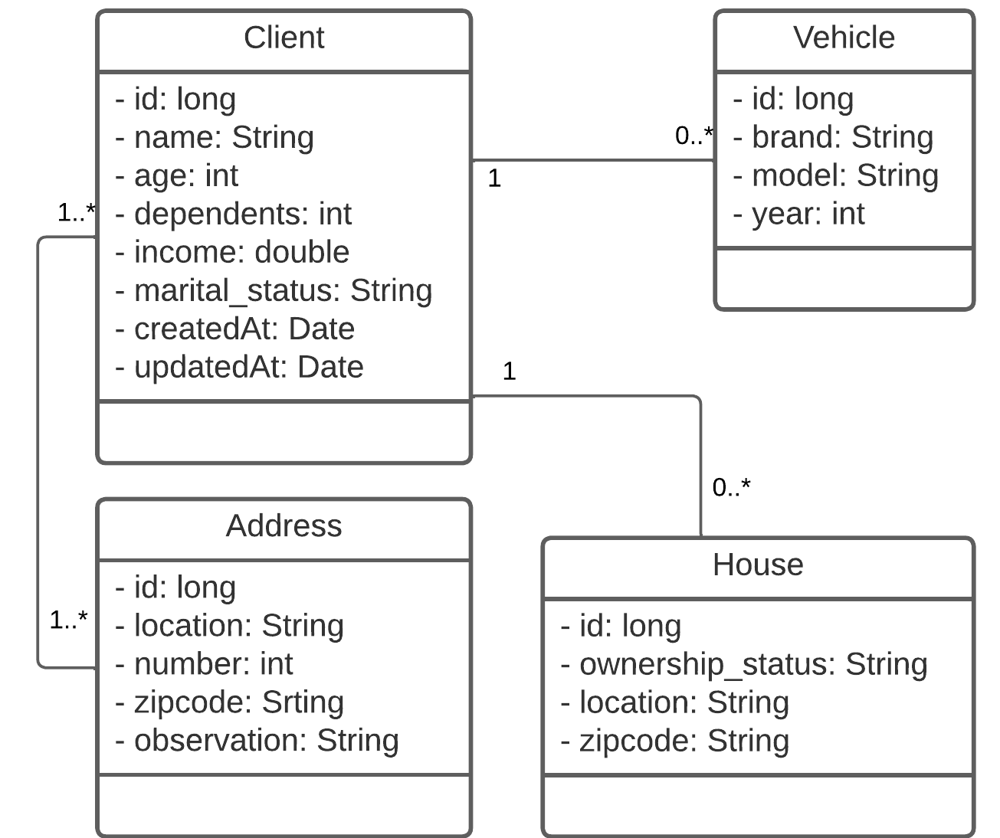

# Tech Challenge - Teste de recrutamento do NExT 2023.1
<!-- PROJECT SHIELDS -->

[](https://img.shields.io/badge/type-Open%20Project-green)
[](https://github.com/NExT-2023-1/desafio-spring/commits/master)
[](https://github.com/NExT-2023-1/desafio-spring/issues)
[](https://github.com/NExT-2023-1/desafio-spring/search?l=python)
[](https://img.shields.io/github/repo-size/NExT-2023-1/desafio-spring)
[](https://img.shields.io/github/contributors/NExT-2023-1/desafio-spring)
[](https://img.shields.io/github/stars/NExT-2023-1/desafio-spring)
[](LICENSE)
[](https://img.shields.io/badge/status-active-success.svg)


<p align="center">
  
</p>


## Overview
Bem-vindo ao teste de teste de recrutamento do NExT 2023.1. Aqui no NExT nós realmente valorizamos código de qualidade, e este teste foi projetado para permitir que você nos mostre como você acha que código de qualidade deve ser escrito.

Para permitir que você se concentre no design e na implementação do código, adicionamos todos os casos de uso que esperamos que você implemente no final das instruções. Em troca, pedimos que você certifique-se de que sua implementação siga todas as melhores práticas que você conhece e que, no final, o código que você enviar seja um código do qual você se orgulhe.

Precisamos de pessoas com energia, integridade e inteligência, que aprendam rápido e que gostem de conhecer e aplicar novas tecnologias.

O tempo sugerido para conclusão do desafio é de 4 dias, mas não é uma regra! Não temos prazo para entrega, queremos que você se dedique e demonstre a qualidade de seu código. Estamos mais interessados em observar a qualidade da solução do que o tempo que você vai demorar.

Estamos interessados ​​em ver como você aborda o desafio, portanto, crie commits e envie-os com mais regularidade do que normalmente faria para que possamos ver cada etapa do desafio.

## Table of Contents

- [Desafio](#desafio)
- [Contexto](#contexto)
- [Fluxo de Versionamento](#fluxo-de-versionamento)


## Desafio

Nesse desafio, você irá desenvolver uma API REST, que atende a empresa NExT Seguros. Agora você irá praticar o que você aprendeu até agora no modulo de java do NExT sobre Java e Spring Boot, para criar uma pequena API para pedidos de seguros.

Essa será uma API que receberá requisições de um aplicativo movel, e retornará e filtrará as linhas de seguro da NExT Seguros e permitirá a analise de perfil do cliente.


## Contexto

O NExT oferece aos seus usuários um pacote de seguros personalizado de acordo com suas necessidades específicas, sem exigir que o usuário entenda nada sobre seguros. Isso permite que o NExT atue como seu consultor de seguros de fato.

O NExT determina as necessidades de seguro do usuário fazendo perguntas pessoais e relacionadas a riscos e coletando informações sobre o veículo e a casa do usuário. Usando esses dados, O NExT determina seu perfil de risco para cada linha de seguro e então sugere um plano de seguro ( "econômico", "regular", "responsável") correspondente ao seu perfil de risco.

Você foi encarregado de criar um serviço que calcule a analise dos seguros e para este desafio, você criará uma versão simplificada desse aplicativo codificando um endpoint de API simples que recebe uma carga JSON com as informações do usuário e retorna seu perfil de risco (JSON novamente).


## Instruções para o desafio

- Fork esse repositório e faça o desafio numa branch com o seu nome (exemplo: nome-sobrenome);
- Faça seus commits no seu repositório;
- Assim que concluir o seu desafio, abra um pull request com suas alterações para a branch main deste repositório.
- Fique à vontade para perguntar qualquer dúvida aos professores e monitores.
- Fique tranquilo, respire, assim como você, também já passamos por essa etapa. Boa sorte! :)

## Para o dia da entrevista técnica

Na data marcada pelo professor tenha sua aplicação rodando na sua máquina local para execução dos testes e para nos mostrar os pontos desenvolvidos e possíveis questionamentos. Faremos um code review junto contigo como se você já fosse do nosso time ❤️, você poderá explicar o que você pensou, como arquitetou e como pode evoluir o projeto.


## Fluxo de Versionamento
Aconselho seguir o [versionamento semântico](https://semver.org/) e o [gitflow](https://www.atlassian.com/br/git/tutorials/comparing-workflows/gitflow-workflow) para versionar este desafio.

## Escopo do desafio

- Documentar todas suposições realizadas;
- O desenvolvimento do back-end deve ser em Spring Boot;
- Não é necessário submeter uma aplicação que cumpra cada um dos requisitos descritos abaixo, mas o que for submetido deve funcionar;
- Informar em um arquivo README.md o passo a passo necessário para rodar o projeto juntamente com o descritivo das funcionalidades que foram atentidas no desafio.

## Requisitos


### Requisitos do cliente

<details>
<summary style="font-size:16px"><b>GET: /clients</b></summary>

### Função

Deve haver uma rota para listar todos os clientes cadastrados;

### Requisição

**URL de Requisição**

> $ curl https://localhost:8080/clients

#### Exemplo de requisição
```JSON
{

}
```

Retorna um Array dos clientes.

#### Exemplo de resposta

```JSON
[
  {
    "id": long,
    "name": String,
    "age": int,
    "dependents": int,
    "houses": List [
      {
        "id": int,
        "ownership_status": String,
        "location": String,
        "zipcode": String
      }
    ],
    "income": float,
    "marital_status": String,
    "vehicles": List [
      {
        "id": 1,
        "brand": String,
        "model": String,
        "year": int
      }
    ],
    "createdAt": Date,
    "updatedAt": Date
  },
  {...},
  {...}
]
```
</details>

<details>
<summary style="font-size:16px"><b>POST: /clients</b></summary>

### Função

Deve haver uma rota para cadastrar um cliente no sistema;

#### Requisição

**Parâmetros**
| Parâmetro | Descrição | Tipo de Parâmetro | Tipo de dado | Obrigatório |
|-----------|-----------|-------------------|--------------|------------|
| `name` | Nome | `body` | `String` | Sim |
| `age` | Idade | `body` | `int` | Sim |
| `dependents` | Numero de dependentes | `body` | `int` | Sim |
| `income` | Renda | `body` | `float` | Sim |
| `marital_status` | estado civil | `body` | `String` | Sim |


**URL de Requisição**

> $ curl -i -H "Content-Type:application/json" -d '{"name": "String", "age": "int", "dependents": "int", "income": "float", "marital_status": "String"}' https://localhost:8080/clients

#### Exemplo de requisição

Envia um objeto do tipo cliente com o formato abaixo.

```JSON
{
  "name": String,
  "age": int,
  "dependents": int,
  "income": float,
  "marital_status": String
}
```

Retorna um Array do cliente cadastrado.

#### Exemplo de resposta

```JSON
[
  {
    "id": long,
    "name": String,
    "age": int,
    "dependents": int,
    "houses": List,
    "income": float,
    "marital_status": String,
    "vehicles": List
  }
]
```
</details>

<details>
<summary style="font-size:16px;"><b>GET: /clients/:id</b></summary>

### Função

Buscar cliente por ID.

#### Requisição

**Parâmetros**
| Parâmetro | Descrição | Tipo de Parâmetro | Tipo de dado | Obrigatório |
|-----------|-----------|-------------------|--------------|------------|
| `id` | ID do cliente | `path` | `long` | Sim |


**URL de Requisição**

> $ curl https://localhost:8080/clients/{id}

#### Exemplo de requisição

```JSON
{

}
```

Retorna um Array do cliente cadastrado.

#### Exemplo de resposta

```JSON
{
  "id": long,
  "name": String,
  "age": int,
  "dependents": int,
  "houses": List [
    {
      "id": int,
      "ownership_status": String,
      "location": String,
      "zipcode": String
    }
  ],
  "income": float,
  "marital_status": String,
  "vehicles": List [
    {
      "id": 1,
      "brand": String,
      "model": String,
      "year": int
    }
  ],
  "createdAt": Date,
  "updatedAt": Date
}
```
</details>

<details>
<summary style="font-size:16px;"><b>PUT: /clients/:id</b></summary>

### Função

Atualizar cliente por ID.

#### Requisição

**Parâmetros**
| Parâmetro | Descrição | Tipo de Parâmetro | Tipo de dado | Obrigatório |
|-----------|-----------|-------------------|--------------|------------|
| `id` | ID do cliente | `path` | `long` | Sim |
| `name` | Nome | `body` | `String` | Não |
| `age` | Idade | `body` | `int` | Não |
| `dependents` | Numero de dependentes | `body` | `int` | Não |
| `income` | Renda | `body` | `float` | Não |
| `marital_status` | estado civil | `body` | `String` | Não |


**URL de Requisição**

> $ curl -X PUT -H "Content-Type:application/json" -d '{"name": "String", "age": "int", "dependents": "int", "income": "float", "marital_status": "String"}' https://localhost:8080/clients/{id}

#### Exemplo de requisição
```JSON
{
  "name": String,
  "age": int,
  "dependents": int,
  "income": float,
  "marital_status": String
}
```

Retorna um Array do cliente cadastrado.

#### Exemplo de resposta

```JSON
{
  "id": long,
  "name": String,
  "age": int,
  "dependents": int,
  "houses": List [
    {
      "id": int,
      "ownership_status": String,
      "location": String,
      "zipcode": String
    }
  ],
  "income": float,
  "marital_status": String,
  "vehicles": List [
    {
      "id": 1,
      "brand": String,
      "model": String,
      "year": int
    }
  ],
  "createdAt": Date,
  "updatedAt": Date
}
```
</details>
<details>
<summary style="font-size:16px;"><b>DELETE: /clients/:id</b></summary>

### Função

Exclui um cliente por ID.

#### Requisição

**Parâmetros**
| Parâmetro | Descrição | Tipo de Parâmetro | Tipo de dado | Obrigatório |
|-----------|-----------|-------------------|--------------|------------|
| `id` | ID do cliente | `path` | `long` | Sim |


**URL de Requisição**

>  $ curl -X DELETE https://localhost:8080/clients/{id}


#### Exemplo de requisição
```JSON
{
  
}
```

Retorna um Array do cliente, suas casas e veículos deletados.
> `lembrando que ao deletar um cliente as suas casas e veículos também deverão ser deletados`.

#### Exemplo de resposta

```JSON
{
  "id": long,
  "name": String,
  "age": int,
  "dependents": int,
  "houses": List [
    {
      "id": int,
      "ownership_status": String,
      "location": String,
      "zipcode": String
    }
  ],
  "income": float,
  "marital_status": String,
  "vehicles": List [
    {
      "id": 1,
      "brand": String,
      "model": String,
      "year": int
    }
  ],
  "createdAt": Date,
  "updatedAt": Date
}
```
</details>


-------------------------------------------------------------
<!-- Requisitos da casa -->


### Requisitos da casa

<details>
<summary style="font-size:16px"><b>GET: /houses</b></summary>

### Função

Listar todas as casas, Filtrar casas por zipcode.

#### Requisição

**Parâmetros**
| Parâmetro | Descrição | Tipo de Parâmetro | Tipo de dado | Obrigatório |
|-----------|-----------|-------------------|--------------|------------|
| `zipcode` | cep da casa | `query` | `String` | Não |

**URL de Requisição**

> $ curl https://localhost:8080/houses[?zipcode=[cep]

#### Exemplo de requisição
```JSON
{

}
```

Retorna um Array das casas.

#### Exemplo de resposta

```JSON
[
  {
    "id": int,
    "ownership_status": String,
    "location": String,
    "zipcode": String
  },
  {...},
  {...}
]
```
</details>

<details>
<summary style="font-size:16px"><b>POST: /houses</b></summary>

### Função

Cria uma nova casa e adiciona ao cliente.

#### Requisição

**Parâmetros**
| Parâmetro | Descrição | Tipo de Parâmetro | Tipo de dado | Obrigatório |
|-----------|-----------|-------------------|--------------|------------|
| `ownership_status` | status da casa | `body` | `String` | Sim |
| `location` | Endereço completo | `body` | `String` | Sim |
| `zipcode` | CEP | `body` | `String` | Sim |
| `client_id` | id do cliente | `body` | `long` | Sim |


**URL de Requisição**

> $ curl -i -H "Content-Type:application/json" -d '{"ownership_status": "String", "location": "String", "zipcode": "String", "client_id": "long"}' https://localhost:8080/houses

#### Exemplo de requisição

Envia um objeto do tipo `casa` com o formato abaixo.

```JSON
{
  "ownership_status": String,
  "location": String,
  "zipcode": String,
  "client_id": long,
}
```

Retorna um objeto do tipo casa cliente cadastrado.

#### Exemplo de resposta

```JSON
{
  "id": long,
  "ownership_status": String,
  "location": String,
  "zipcode": String
}
```
</details>

<details>
<summary style="font-size:16px;"><b>PUT: /houses/:id</b></summary>

### Função

Atualizar uma casa por ID.

#### Requisição

**Parâmetros**
| Parâmetro | Descrição | Tipo de Parâmetro | Tipo de dado | Obrigatório |
|-----------|-----------|-------------------|--------------|------------|
| `id` | ID da casa | `path` | `long` | Sim |
| `ownership_status` | status da casa | `body` | `String` | Não |
| `client_id` | id do cliente | `body` | `long` | Não |


**URL de Requisição**

> $ curl -X PUT -H "Content-Type:application/json" -d '{"ownership_status": "String", "client_id": "long"}' https://localhost:8080/houses/{id}

#### Exemplo de requisição
```JSON
{
  "ownership_status": String,
  "client_id": long
}
```

Retorna um objeto do tipo casa alterado.

#### Exemplo de resposta

```JSON
{
  "id": long,
  "ownership_status": String,
  "location": String,
  "zipcode": String,
}
```
</details>
<details>
<summary style="font-size:16px;"><b>DELETE: /houses/:id</b></summary>

### Função

Exclui uma casa por ID.

#### Requisição

**Parâmetros**
| Parâmetro | Descrição | Tipo de Parâmetro | Tipo de dado | Obrigatório |
|-----------|-----------|-------------------|--------------|------------|
| `id` | ID do cliente | `path` | `long` | Sim |


**URL de Requisição**

>  $ curl -X DELETE https://localhost:8080/houses/{id}


#### Exemplo de requisição
```JSON
{
  
}
```

Retorna um Array do cliente, suas casas e veículos deletados.
> `lembrando que ao deletar um cliente as suas casas e veículos também deverão ser deletados`.

#### Exemplo de resposta

```JSON
{
  "id": long,
  "ownership_status": String,
  "location": String,
  "zipcode": String,
}
```
</details>


-------------------------------------------------------------
<!-- Requisitos do veículo -->


### Requisitos do veículo

<details>
<summary style="font-size:16px"><b>POST: /vehicles</b></summary>

### Função

Cria um novo veiculo.

#### Requisição

**Parâmetros**
| Parâmetro | Descrição | Tipo de Parâmetro | Tipo de dado | Obrigatório |
|-----------|-----------|-------------------|--------------|------------|
| `brand` | status da casa | `body` | `String` | Sim |
| `model` | Endereço completo | `body` | `String` | Sim |
| `year` | CEP | `body` | `String` | Sim |


**URL de Requisição**

> $ curl -i -H "Content-Type:application/json" -d '{"brand": "String", "model": "String", "year": "int"}' https://localhost:8080/vehicles

#### Exemplo de requisição

Envia um objeto do tipo `casa` com o formato abaixo.

```JSON
{
  "brand": String,
  "model": String,
  "year": int
}
```

Retorna um objeto do tipo veículo cadastrado.

#### Exemplo de resposta

```JSON
{
  "id": long,
  "brand": String,
  "model": String,
  "year": int
}
```
</details>

<details>
<summary style="font-size:16px;"><b>PUT: /vehicles/:id/clients</b></summary>

### Função

Cria uma associação entre cliente e veículo.

#### Requisição

**Parâmetros**
| Parâmetro | Descrição | Tipo de Parâmetro | Tipo de dado | Obrigatório |
|-----------|-----------|-------------------|--------------|------------|
| `id` | ID da casa | `path` | `long` | Sim |
| `client_id` | id do cliente | `body` | `long` | Não |


**URL de Requisição**

> $ curl -i -X PUT -d '{"client_id": "long"}' https://localhost:8080/vehicles/{id}/clients

#### Exemplo de requisição
```JSON
{
  "client_id": long
}
```

Retorna um objeto do tipo veículo alterado que foi associado a um cliente.

#### Exemplo de resposta

```JSON
{
  "id": long,
  "brand": String,
  "model": String,
  "year": int
}
```
</details>

<details>
<summary style="font-size:16px;"><b>DELETE: /vehicles/:id</b></summary>

### Função

Remover uma associação entre veiculo e cliente e exclui o veiculo por ID.
> `caso este veículo não tenha associação com nenhum cliente, deverá ser apenas excluido.`

#### Requisição

**Parâmetros**
| Parâmetro | Descrição | Tipo de Parâmetro | Tipo de dado | Obrigatório |
|-----------|-----------|-------------------|--------------|------------|
| `id` | ID do cliente | `path` | `long` | Sim |


**URL de Requisição**

>  $ curl -X DELETE https://localhost:8080/vehicles/{id}


#### Exemplo de requisição
```JSON
{
  
}
```

Retorna um objeto do tipo veículo que foi deletado.
> `lembrando que ao deletar um veículo o cliente não será afetado`.

#### Exemplo de resposta

```JSON
{
  "id": long,
  "brand": String,
  "model": String,
  "year": int
}
```
</details>


-------------------------------------------------------------
<!-- Requisitos do Seguro -->


### Requisitos do Seguro

<details>
<summary style="font-size:16px"><b>POST: /insurances/life</b></summary>

### Função

Realiza a analise de risco para a linha de seguro vida.

#### Requisição

**Parâmetros**
| Parâmetro | Descrição | Tipo de Parâmetro | Tipo de dado | Obrigatório |
|-----------|-----------|-------------------|--------------|------------|
| `risk_questions` | Questões de risco. | `body` | `[boolean,boolean,boolean]` | Sim |
| `client_id` | ID do cliente | `body` | `long` | Sim |


**URL de Requisição**

> $ curl -i -H "Content-Type:application/json" -d '{"risk_questions": "[bool,bool,bool]", "client_id": "long"}' https://localhost:8080/insurances/life

#### Exemplo de requisição

Envia um objeto do tipo `seguro` com o formato abaixo.

```JSON
{
  "risk_questions": List [boolean, boolean, boolean],
  "client_id": long
}
```

Retorna um objeto do tipo seguro cadastrado, após realizar a analise de risco para a linha de seguro vida.

#### Exemplo de resposta

```JSON
{
 "id": long,
 "type": String,
 "risk": int,
 "analysis": Srting,
 "observation": String,
 "createdAt": Date,
 "validateAt": Date
}
```
</details>


<details>
<summary style="font-size:16px"><b>POST: /insurances/disability</b></summary>

### Função

Realiza a analise de risco para a linha de seguro invalidez.

#### Requisição

**Parâmetros**
| Parâmetro | Descrição | Tipo de Parâmetro | Tipo de dado | Obrigatório |
|-----------|-----------|-------------------|--------------|------------|
| `risk_questions` | Questões de risco. | `body` | `[boolean,boolean,boolean]` | Sim |
| `client_id` | ID do cliente | `body` | `long` | Sim |


**URL de Requisição**

> $ curl -i -H "Content-Type:application/json" -d '{"risk_questions": "[bool,bool,bool]", "client_id": "long"}' https://localhost:8080/insurances/disability

#### Exemplo de requisição

Envia um objeto do tipo `seguro` com o formato abaixo.

```JSON
{
  "risk_questions": List [boolean, boolean, boolean],
  "client_id": long
}
```

Retorna um objeto do tipo seguro cadastrado, após realizar a analise de risco para a linha de seguro invalidez.

#### Exemplo de resposta

```JSON
{
 "id": long,
 "type": String,
 "risk": int,
 "analysis": Srting,
 "observation": String,
 "createdAt": Date,
 "validateAt": Date
}
```
</details>


<details>
<summary style="font-size:16px"><b>POST: /insurances/home</b></summary>

### Função

Realiza a analise de risco para a linha de seguro residencial.

#### Requisição

**Parâmetros**
| Parâmetro | Descrição | Tipo de Parâmetro | Tipo de dado | Obrigatório |
|-----------|-----------|-------------------|--------------|------------|
| `risk_questions` | Questões de risco. | `body` | `[boolean,boolean,boolean]` | Sim |
| `client_id` | ID do cliente | `body` | `long` | Sim |
| `house_id` | ID da casa | `body` | `long` | Sim |


**URL de Requisição**

> $ curl -i -H "Content-Type:application/json" -d '{"risk_questions": "[bool,bool,bool]", "client_id": "long"}' https://localhost:8080/insurances/home

#### Exemplo de requisição

Envia um objeto do tipo `seguro` com o formato abaixo.

```JSON
{
  "risk_questions": List [boolean, boolean, boolean],
  "client_id": long,
  "house_id": long
}
```

Retorna um objeto do tipo seguro cadastrado, após realizar a analise de risco para a linha de seguro residencial.

#### Exemplo de resposta

```JSON
{
 "id": long,
 "type": String,
 "risk": int,
 "analysis": Srting,
 "observation": String,
 "createdAt": Date,
 "validateAt": Date
}
```
</details>


<details>
<summary style="font-size:16px"><b>POST: /insurances/auto</b></summary>

### Função

Realiza a analise de risco para a linha de seguro automóvel.

#### Requisição

**Parâmetros**
| Parâmetro | Descrição | Tipo de Parâmetro | Tipo de dado | Obrigatório |
|-----------|-----------|-------------------|--------------|------------|
| `risk_questions` | Questões de risco. | `body` | `[boolean,boolean,boolean]` | Sim |
| `client_id` | ID do cliente | `body` | `long` | Sim |
| `vehicle_id` | ID do veículo | `body` | `long` | Sim |


**URL de Requisição**

> $ curl -i -H "Content-Type:application/json" -d '{"risk_questions": "[bool,bool,bool]", "client_id": "long"}' https://localhost:8080/insurances/auto

#### Exemplo de requisição

Envia um objeto do tipo `seguro` com o formato abaixo.

```JSON
{
  "risk_questions": List [boolean, boolean, boolean],
  "client_id": long,
  "vehicle_id": long
}
```

Retorna um objeto do tipo seguro cadastrado, após realizar a analise de risco para a linha de seguro automóvel.

#### Exemplo de resposta

```JSON
{
 "id": long,
 "type": String,
 "risk": int,
 "analysis": Srting,
 "observation": String,
 "createdAt": Date,
 "validateAt": Date
}
```
</details>


-------------------------------------------------------------


## Especificações

<details>
<summary style="font-size:16px"><b>Atributos do Cliente</b></summary>
Todos os atributos simples do Cliente são obrigatórios:

- **`name`**: Nome (um valor textual referente ao nome do cliente).
- **`age`**: Idade (um número inteiro igual ou maior que 0).
- **`dependents`**: O número de dependentes (um número inteiro igual ou maior que 0).
- **`income`**: Renda (um número inteiro igual ou maior que 0).
- **`marital_status`**: Estado civil ( "`single`" ou "`married`").
- **`houses`**: Casas
  - Os usuários podem ter 0 ou mais casas.
- **`vehicles`**: Veículos
  - Os usuários podem ter 0 ou mais veículos.
- **`createdAt`**: Data de criação do cliente.
- **`updatedAt`**: Data de atualização do cliente.
</details>

<details>
<summary style="font-size:16px"><b>Atributos da Casa</b></summary>
Todos os atributos da casa são obrigatórios:

  - **`ownership_status`**: Um valor textual que pode ser "`owned`" ou "`mortgaged`"
  - **`location`**: Um valor textual que terá o endereço completo da casa.
  - **`zipcode`**: Um valor textual que terá o CEP.

</details>

<details>
<summary style="font-size:16px"><b>Atributos do Veículo</b></summary>
Todos os atributos não chave do veículo são obrigatórios(salve exceção a PK):

  - **`brand`**: Um valor textual correspondente a marca
  - **`model`**: Um valor textual correspondente ao modelo
  - **`year`**: Um número inteiro positivo correspondente ao ano que foi fabricado.
</details>

<details>
<summary style="font-size:16px"><b>Atributos do Seguro</b></summary>
Todos os atributos do Seguro são obrigatórios, exceto o campo `observation`:

- **`type`**: Um valor textual que pode ser "`life`", "`disability`", "`home`" ou "`auto`".
- **`risk`**: Um número inteiro correspondente a pontuação do risco
- **`analysis`**: Um valor textual que pode ser "`economic`", "`regular`" ou "`responsible`".
- **`observation`**: Um valor textual correspondente a observação do seguro
- **`createdAt`**: Data de criação da analise.
- **`validatedAt`**: Data de validade da analise.

</details>

### O algoritmo de risco

O aplicativo recebe a carga JSON por meio dos endpoints da API e a transforma em um perfil de risco calculando uma pontuação de risco para cada ramo de seguro (vida, invalidez, residencial e automóvel) com base nas informações fornecidas pelo usuário.

Primeiro, calcula a pontuação base somando as respostas das questões de risco, resultando em um número que varia de 0 a 3. Em seguida, aplica as seguintes regras para determinar uma pontuação de risco para cada ramo de seguro.

- Caso a usuária não possua renda, veículos ou moradia, ela fica inelegível para seguro de invalidez, automóvel e residência, respectivamente.
- Se o usuário tiver mais de 60 anos, ele não terá direito ao seguro de invalidez e de vida.
- Se o usuário tiver menos de 30 anos, desconta 2 pontos de risco de todos os ramos de seguro. Se ela tiver entre 30 e 40 anos, descontar 1.
- Se a renda dela for superior a US$ 200 mil, deduza 1 ponto de risco de todas as linhas de seguro.
- Se a casa do usuário estiver hipotecada, adicione 1 ponto de risco à pontuação da casa.
- Para cada casa do usuario que estiver hipotecada, adicione 1 ponto de risco à pontuação de incapacidade.
- Se o usuário tiver dependentes, adicione 1 ponto de risco aos escores de incapacidade e de vida.
- Se o usuário for casado, adicione 1 ponto de risco à pontuação de vida e remova 1 ponto de risco de incapacidade.
- Se o veículo do usuário foi produzido nos últimos 5 anos, adicione 1 ponto de risco à pontuação desse veículo.


Este algoritmo resulta numa pontuação final para cada ramo de seguro, que deve ser analisada utilizando os seguintes intervalos:

- 0 e abaixo são mapeados para `“economic”`.
- 1 e 2 são mapeados para `“regular”`.
- 3 e acima mapeia para `“responsible”` .

Lembrando que uma analise de segura tem validade de 30 dias, ou seja, um mês.

## Etapas do projeto

### 1. Primeira Etapa

- Configure o seu projeto para que se conecte a um banco de dados MySQL.
- Desenvolva as entidades, crie os relacionamentes entre as classes de acordo com o diagrama a baixo e faça o mapeamento das entidade para serem persistidos em um banco de dados MySQL.
  - > Obs.: crie as entidade se baseando nas [especificações](#especificações) de cada entidade.
- Crie os repositories para cada uma das entidades que serão persistidas no banco de dados.
- Extra/Opcional:
  - Criar outras classes que servirão para representar alguns dos requests e responses da sua API.
  - Crie alguns registros no banco para testar a sua implementação



### 2. Segunda Etapa

- Desenvolva as rotas especificadas nos [requisitos](#requisitos), começando com os [requisitos do cliente](#requisitos-do-cliente), logo depois faça os [requisitos da casa](#requisitos-da-casa) e por fim os [requisitos do veículo](#requisitos-do-veículo).
- Crie as classes que servirão para representar os requests e responses da sua API.
- Crie os servises de cada uma das entidades.
- Os [requisitos do seguro](#requisitos-do-seguro), não deverão ser implementados na 2º etapa.

### 3. Terceira Etapa

- Desenvolva as rotas espeficicadas nos [requisitos do seguro](#requisitos-do-seguro):
  - [POST: /insurances/life](#func3a7c3a3o-12)
  - [POST: /insurances/disability](#func3a7c3a3o-13)
  - [POST: /insurances/home](#func3a7c3a3o-14)
  - [POST: /insurances/auto](#func3a7c3a3o-15)

- Bonus:
  - Ao final do desafio serão selecionados alguns participantes para serem entrevistados, seguindo as recomendações [para o dia da entrevista técnica](#para-o-dia-da-entrevista-técnica)

## Critérios de Avaliação

Queremos avaliar sua capacidade de desenvolver e documentar um back-end para uma aplicação. 

### O que será avaliado

- O código será avaliado seguindo os seguintes critérios: 
  - Manutenabilidade
  - Código bem escrito, clareza e limpeza de código;
  - Legibilidade e a quantidade de funcionalidades implementadas.
  - Resultado funcional, entre outros fatores;
- O histórico no git também será avaliado:
  - Commits e organização das alterações realizadas - não é obrigatório multiplas branches, se julgar necessário fique a vontade.
- Inclusão de um arquivo README que possua:
  - desafios/problemas com os quais você se deparou durante a execução do projeto.
  - maneiras através das quais você pode melhorar a aplicação, seja em performance, estrutura ou padrões.
  - todas as intruções necessárias para que qualquer pessoa consiga rodar sua aplicação sem maiores problemas.
- Quais ferramentas foram usadas, como e por quê, além do seu conhecimento das mesmas;
- Seu conhecimento em banco de dados, requisições HTTP, APIs REST, etc;
- Sua capacidade de se comprometer com o que foi fornecido;
- Sua capacidade de documentação da aplicação.
- Todos os requisitos acima devem ser cumpridos, seguindo o padrão de rotas estabelecido;
- Capacidade de explicar as decisões técnicas tomadas, as escolhas por bibliotecas e ferrramentas, o uso de patterns etc.

#### Bônus

Se você julgar necessário, adequado ou quiser deixar a aplicação mais completa (bônus!) você pode adicionar outras rotas, métodos, meios de autenticação com usuários, etc.

Você é livre para tomar as decisões técnicas com as quais você se sente mais confortável. Apenas esteja pronto(a) para explicar as razões que fundamentaram suas escolhas =]

### O mínimo necessário

- Uma aplicação contendo uma API real simples, sem autenticação, que atenda os requisitos descritos acima, fazendo requisições à um banco de dados para persistência;
- README.md contendo informações básicas do projeto e como executá-lo;


## Pontuação dos criterios

### Entrega

- O código possui algum controle de dependências? = 1 ponto
- O resultado final está completo para ser executado?  = 1 ponto
- O resultado final atende ao que se propõe fazer?  = 1 ponto
- O resultado final atende totalmente aos requisitos propostos? = 1 ponto

### Boas Práticas
- O código está de acordo com o guia de estilo do Java e do Spring Boot? = 1 ponto
- O código está bem estruturado? = 1 ponto
- O código está fluente na linguagem? = 1 ponto
- O código faz o uso correto de Design Patterns? = 1 ponto

### Documentação
- O código foi entregue com um arquivo de README claro de como se guiar? = 1 ponto
- O código possui comentários pertinentes? = 1 ponto
- O código está em algum controle de versão? = 1 ponto
- Os commits são pequenos e consistentes? = 1 ponto
- As mensagens de commit são claras? = 1 ponto

### Código Limpo
- O código possibilita expansão para novas funcionalidades? = 1 ponto
- O código é Don't Repeat Yourself? = 1 ponto
- O código é fácil de compreender? = 1 ponto

### Controle de Qualidade
- O código possui configuração de lint? = 1 ponto
- O código possui testes unitários? = 1 ponto
- O código possui teste de cobertura? = 1 ponto
- O código está em Integração Contínua? = 1 ponto

## Diferenciais
- Tratamento de erros
- Docker
- Boa documentação de código;
- Testes do código.

## Dicas

- Documente seu projeto em arquivos markdown explicando a estrutura, processo de setup e requisitos.
- Tenha sempre um mindset de usabilidade, escalabilidade e colaboração.
- A organização das branches e os commits no repositório falam muito sobre como você organiza seu trabalho.
- Tenha em mente os conceitos de SOLID.
- Use boas práticas de programação.
- Considere que não sabemos nada sobre os seus conhecimentos, então quanto mais você mostrar e o quão mais descritiva for sua documentação, melhor =]

## FAQ
**Posso utilizar outras bibliotecas que não foram vistas no curso?**

Você pode usar outras bibliotecas que não foram apresentadas no curso, mas queremos que a solução de arquitetura seja sua, portanto não use bibliotecas que impõem uma arquitetura/código específico.

**Quanto `tempo` eu tenho ?**

O projeto terá o limite de 4 dias, mas poderá ser realizado em bem menos, portanto, quanto mais tempo você demorar, mais críticos seremos na sua avaliação =]

**Qual `banco de Dados` devo usar?**

Escolha entre `MySQL` e `H2`.

**Posso usar o `RepositoryRestResource`?**

O uso do `Rest Repositories` é permitido apenas para criar um CRUD. No entanto, para podermos avaliar os seus conhecimentos em ***`Spring`*** pedimos que não use o `RepositoryRestResource` para criar um CRUD.

## Expandindo os horizontes

Essa é uma aplicação totalmente escalável, isso significa que além das específicações, após finalizado o desafio, é totalmente possível implementar mais funcionalidades a essa aplicação, e essa será uma ótima maneira para fixar os conhecimentos.

Você pode implementar desde funcionalidades simples que não foram específicadas no desafio, como a inclusão de uma nova modalidade de seguro desemprego, ou uma rota que irá retornar os dados de casas onde todos que moram nela tem seguro.

Faça um post no Linkedin ou Instagram e postar o código do Github é uma boa forma de demonstrar seus conhecimentos e esforços para evoluir na sua carreira para oportunidades futuras.

Além disso, use sua criatividade para testar novas coisas, existem muitas possibilidades de aprendizado! 🚀

## Licença

Esse projeto está sob a licença MIT. Veja o arquivo [LICENSE](LICENSE) para mais detalhes.

---

Feito com 💜 by GersonRS

## Dúvidas

Quaisquer dúvidas que você venha a ter, consulte as [issues](https://github.com/NExT-2023-1/desafio-spring/issues) para ver se alguém já não a fez e caso você não ache sua resposta, abra você mesmo uma nova issue!


### Happy coding e Boa Sorte!


